# Top 28 Domain Registration Platforms in 2025 (Latest Updated)

Finding the right domain registrar shapes how smoothly you manage your online presence. Whether you're launching a startup, building a personal portfolio, or scaling an enterprise, the platform you choose determines your DNS control speed, renewal transparency, and long-term costs. This curated list walks through 28 domain registration services ranked by comprehensive value, helping you match technical needs with budget realities and avoid surprise renewal fees down the road.

***

## **[Spaceship](https://www.spaceship.com)**

Next-generation domain management built for complete digital control with intelligent automation and streamlined workflows.

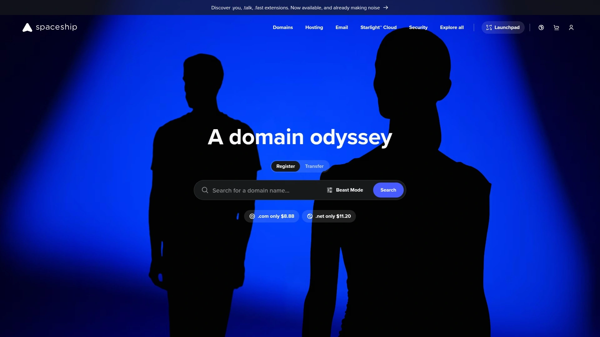

Spaceship delivers high-performance domain management through advanced tools and intelligent automation features. The platform includes the Launchpad command interface, activated with Ctrl/cmd + K, enabling instant access to accounts, products, and apps through tech that remembers your patterns. You get sophisticated DNS control, security center management with device tracking, connection manager for linking products, and a communication center for centralized messaging. The Domains List interface simplifies registration settings and related services, while the Transfer Manager provides easy status checks. Alf, the intelligent digital assistant, redefines customer experience by handling complex queries. Advanced hosting, email services, and tool integrations extend beyond basic registration. The platform emphasizes transparency and European data center hosting for privacy-conscious users. Built for developers and businesses requiring granular control, Spaceship combines modern design with powerful backend capabilities that scale with growing portfolios.

***

## **[Porkbun](https://porkbun.com)**

Affordable registration with transparent pricing and premium features included at no extra cost for budget-conscious domain buyers.

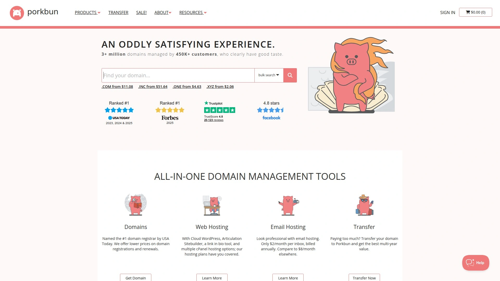

Porkbun stands out with genuinely transparent pricing that displays both first-year and renewal rates upfront, eliminating surprise costs. Every domain includes free WHOIS privacy protection, Let's Encrypt SSL certificates that auto-renew when using their nameservers, URL forwarding, email forwarding, and comprehensive DNS management. The platform supports over 500 domain extensions including premium TLDs like .ai and .io. Registration starts around $7.97 annually with competitive renewal rates significantly lower than major competitors. Porkbun pioneered free SSL certificates through Let's Encrypt integration and maintains English-native support without outsourcing. The interface provides bulk management options for portfolio owners. Web hosting and email hosting trials come free with registrations. Their cheeky brand personality and dorky graphics belie serious technical capabilities. Developers particularly appreciate HTTPS forwarding features for parked domains and the straightforward management dashboard. Since Google Domains closed, Porkbun has seen 50x increases in domain transfers, proving their value proposition resonates with technical users.

***

## **[Cloudflare Registrar](https://www.cloudflare.com/products/registrar/)**

At-cost domain pricing with zero markup and built-in security through native CDN and DNS integration.

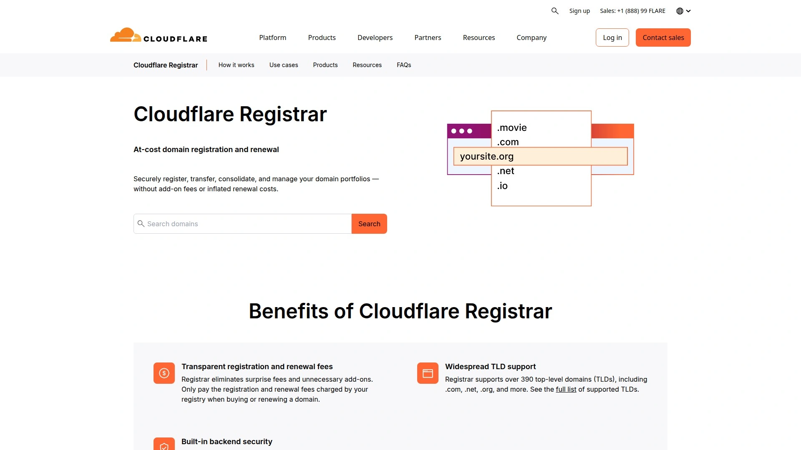

Cloudflare Registrar eliminates surprise fees by charging only what registries and ICANN require, with no added markup for registration or renewal. Supporting over 390 top-level domains including .com, .net, and .org, the service natively integrates with Cloudflare's DNS, CDN, and SSL infrastructure for best-in-class security and performance. You get free universal DNSSEC with one-click activation, protecting against on-path attacks. The platform defends high-profile domains through registry lock, customizable authorization, and out-of-band authentication features. Domain management happens directly in the Cloudflare Dashboard where you can easily transfer, renew, and configure automatic renewals. Backend security comes standard rather than as an add-on. For users already leveraging Cloudflare's network services, registrar integration creates seamless workflows without DNS propagation delays. Transparent pricing means a .com domain costs $10.44 annually for both registration and renewal, with no price jumps. Technical users appreciate API access for automated domain provisioning, particularly useful for wildcard SSL certificate generation through Let's Encrypt.

***

## **[Namecheap](https://www.namecheap.com)**

Long-established registrar offering competitive first-year pricing with free WHOIS privacy and extensive TLD selection.

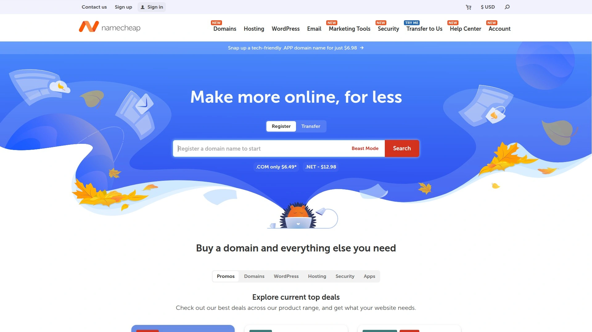

Founded in 2000, Namecheap manages over 7 million domains and earned recognition as Best Domain Name Registrar by Lifehacker in 2010. The platform provides domain name suggestions as you type, generating alternatives with different extensions and projected yearly fees. Registration starts at $8.99 annually for .com domains, with free WHOISGuard protection included for every eligible registration and transfer. Services extend beyond registration to web hosting, SSL certificates, app integration, data migration, and WHOIS lookup tools. The knowledge base, live chat, and ticket support systems provide readily available customer assistance. Namecheap's pricing remains competitive over the long term, with renewal rates around $16.22 for .com domains, lower than many competitors' surprise renewal hikes. The platform supports hundreds of domain extensions with straightforward pricing tables. ICANN accreditation ensures compliance and reliability. Monthly renewal options provide flexibility unavailable at many registrars. Interface design prioritizes simplicity, making domain management accessible for beginners while offering advanced DNS controls for technical users.

***

## **[GoDaddy](https://www.godaddy.com)**

Market-leading registrar with extensive domain inventory and 24/7 phone support for immediate assistance.

GoDaddy dominates market share as one of the world's largest domain registrars, offering aggressive first-year pricing as low as $0.99 for .com domains. The platform provides 24/7 phone support with direct access to real representatives, distinguishing it from competitors with automated systems. Daily backups come standard, surpassing the weekly backups most providers offer. Services span domain registration, website builders, online marketing tools, and comprehensive hosting solutions. The extensive TLD selection covers hundreds of extensions including country codes and specialty domains. GoDaddy's domain marketplace enables buying and selling premium domains. Interface design emphasizes ease of use with streamlined checkout processes. However, renewal rates jump significantly after the first year, with .com domains renewing around $20+ annually. The platform frequently runs promotional campaigns with steep discounts. SSL certificates, WHOIS privacy, and email services are available as add-ons. For users prioritizing immediate support and don't mind higher renewal costs, GoDaddy's infrastructure and immediate phone access provide peace of mind.

***

## **[Dynadot](https://www.dynadot.com)**

Over 600 TLD support with integrated domain marketplace and auction system for buying premium domains.

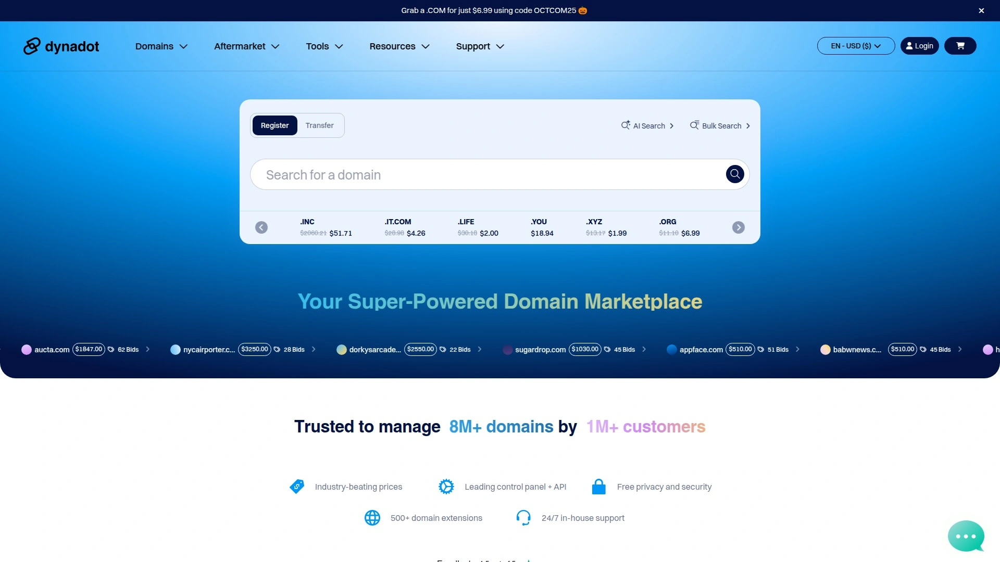

Dynadot supports over 600 domain extensions from standard .com and .net to specialized TLDs like .ai, making it ideal for modern tech businesses. Pricing runs $12.99 yearly for .com and .net, with uncommon extensions like .cloud and .blog ranging $19-$26 annually after first-year discounts as low as $3.85. The integrated marketplace enables direct negotiation between buyers and sellers, while the auction system lets you bid on premium domains over seven-day periods. Free lifetime WHOIS privacy protects against spammers and scammers. Limited access to website builder tools, email services connected to your domain, and logo creator utilities come included. The platform's for-sale landing page feature helps market domains you're selling. Dynadot provides bulk management tools for portfolio owners and supports international TLDs across multiple countries. Founded in 2002, the registrar maintains 24/7 support and powerful management interfaces. Storage costs remain competitive, and the straightforward dashboard avoids overwhelming users with unnecessary upsells. Premium domain buyers appreciate transparent auction mechanics and direct seller communication channels.

***

## **[Hover](https://www.hover.com)**

Privacy-focused Canadian registrar with clean interface and exceptional phone support for straightforward domain management.

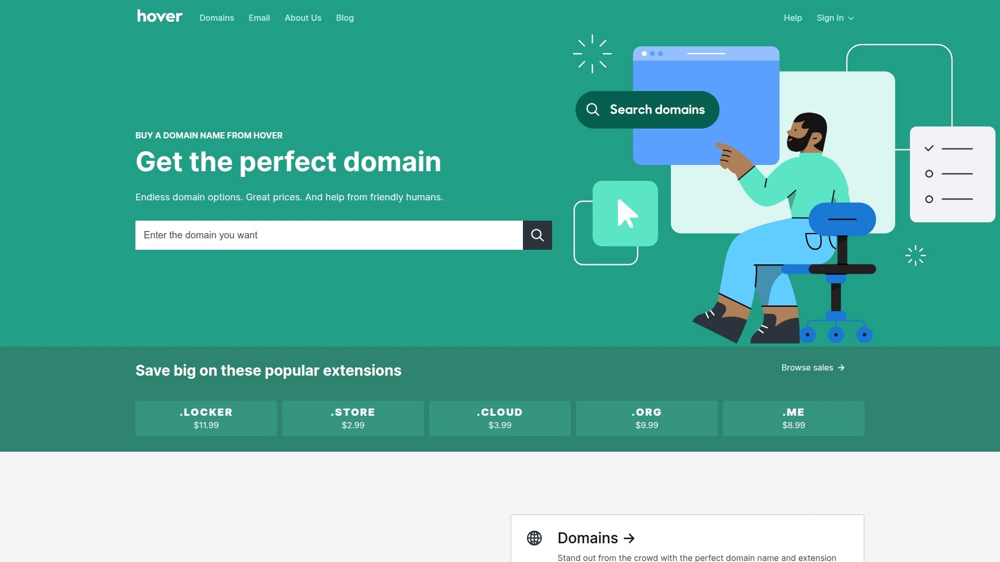

Hover, a Tucows subsidiary formed in 2008, emphasizes simplicity and privacy in domain registration. Free WHOIS privacy protection comes with every domain, keeping personal information safe from public registry databases. The user-friendly interface avoids cluttered dashboards and aggressive upsells, making domain search, registration, and checkout take just minutes. Pricing ranges from $10-$20 annually for generic extensions like .com and .net, with atypical ones like .io costing $30-$40 yearly. Custom email using your domain costs $5 annually, with storage upgrades at $20 per year for 10GB or $29 for 1TB. Phone support stands out as superb, with instant connections to real representatives rather than automated systems, while email inquiries receive responses within 24 hours. The extensive knowledge base covers domain registration, transfers, and email setup thoroughly. Hover supports hundreds of TLDs and sometimes offers steep first-year discounts under $5. The platform provides no web hosting or website builder services, focusing exclusively on domain management and email. Users appreciate the straightforward pricing model with less upselling compared to major competitors, though renewal rates run higher than budget registrars.

***

## **[Gandi](https://www.gandi.net)**

European-based registrar emphasizing transparency and privacy with 10-day free hosting trial and multilingual support.

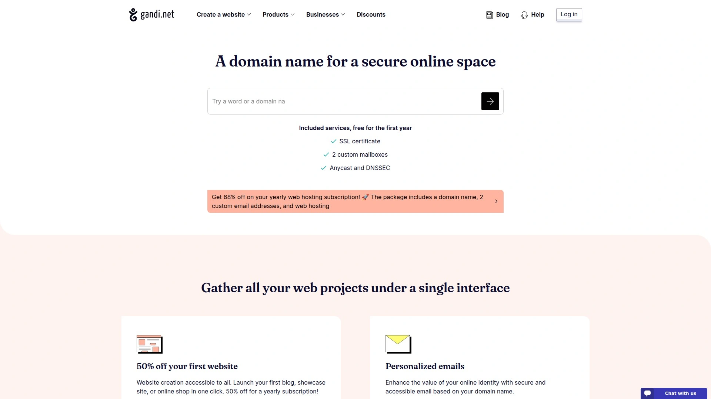

Gandi, a French provider popular throughout Europe, combines domain registration with web hosting, SSL certificates, and VPS servers. The platform offers a unique 10-day free trial for testing hosting quality before committing. Hosting plans start at $3.75 monthly with 99.95% uptime guarantees and 24/6 email support in multiple languages. Automatic linking between domain names and hosting simplifies setup when both services run through Gandi's LiveDNS platform. Storage scales from 20GB on Starter plans to 200GB on Business tiers, with expandable storage up to 1TB at €0.18-€0.22 per GB monthly. Free SSL certificates secure all sites, and Varnish web acceleration caches frequently viewed content for faster loading. Simple WordPress installation takes about one minute, and automatic snapshot backups enable easy recovery of previous versions. Language choices include PHP, Node.js, Python, Ruby, with MySQL or PostgreSQL databases. European data center hosting emphasizes transparency and GDPR compliance. AWS uses Gandi infrastructure for many domains, demonstrating enterprise-grade reliability. The platform suits developers needing flexible, powerful hosting alongside domain management. Support responsiveness and user-friendly tools make complex technical tasks accessible.

***

## **[Name.com](https://www.name.com)**

Operating since 2003 with straightforward domain registration and comprehensive DNS management tools.

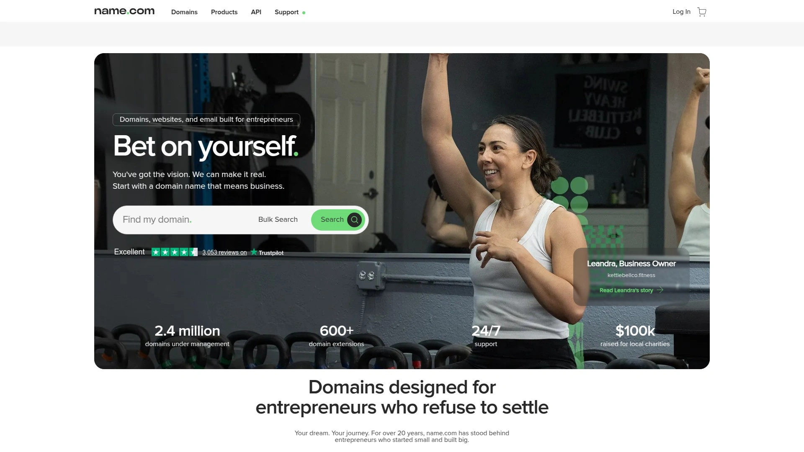

Name.com provides domain registration, website builders, and hosting services through a clean, intuitive interface. The platform has operated for over two decades, building reputation through consistent service and reliability. Domain pricing remains competitive with transparent renewal rates displayed upfront. Free WHOIS privacy, DNS management, and email forwarding come standard with registrations. The website builder integrates seamlessly with registered domains, enabling quick site launches without technical expertise. SSL certificates, web hosting, and email services expand beyond basic registration. Support options include knowledge base articles, ticket systems, and responsive customer service teams. Name.com supports hundreds of domain extensions covering global markets and specialized industries. The platform emphasizes security with two-factor authentication and account protection features. Portfolio management tools help users with multiple domains organize registrations, renewals, and DNS settings efficiently. Bulk registration discounts benefit businesses acquiring multiple domains simultaneously. The registrar's longevity demonstrates stability in an industry where providers frequently merge or discontinue services. Clean interface design avoids overwhelming new users while providing advanced controls for technical requirements.

***

## **[Squarespace Domains](https://domains.squarespace.com)**

Integrated domain service from Squarespace providing seamless website builder connectivity and automated DNS configuration.

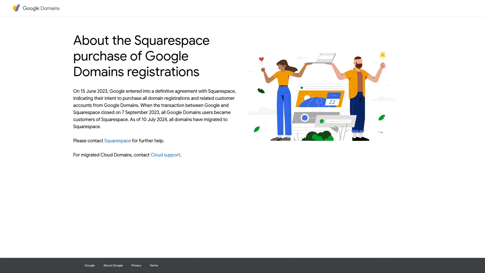

Squarespace acquired all Google Domains registrations in September 2023, migrating millions of domains to their platform. Users manage domains through Squarespace accounts with free domain and email forwarding included for all managed domains. The integration with Squarespace's website builder creates streamlined workflows where domain DNS configuration happens automatically during site creation. Annual domain pricing remains competitive, and existing Google Domains customers maintained their renewal rates through the transition. The platform provides clean domain management dashboards, SSL certificate integration, and comprehensive DNS controls. Email services and custom mailboxes connect easily to registered domains. Domain transfers in and out follow standard procedures with auth codes and unlock toggles. Squarespace emphasizes design-focused tools, making the registrar particularly appealing for creative professionals and businesses already using Squarespace websites. Support includes extensive documentation, email assistance, and chat options. The acquisition brought enterprise-grade infrastructure to Squarespace's domain services. For users seeking unified control over domains and websites in one platform, Squarespace eliminates multi-platform juggling. WHOIS privacy and security features meet industry standards while simplified interfaces reduce technical barriers.

***

## **[IONOS](https://www.ionos.com)**

German hosting provider with exceptional site speed and uptime plus aggressive introductory pricing.

IONOS delivers the best site speed and uptime in comparison testing, making it reliable for sites of all sizes. Introductory deals start at $1 monthly for the first six months on Plus plans with 12-month terms. Daily automatic backups protect data better than competitors offering weekly backups. The carbon-neutral provider maintains commitment to sustainability across operations. Signing up for 36-month terms grants the first year free, though renewal prices increase considerably afterward. Hosting options include shared, dedicated, WordPress, and cloud servers with 99.9% uptime guarantees. Domain registration integrates directly with hosting services for seamless setup. Free SSL certificates and DDoS protection come standard. Email hosting includes professional mailboxes at your domain. The platform suits businesses prioritizing performance and reliability over rock-bottom pricing. Interface design remains functional though less polished than some competitors. Support quality varies, with some users reporting slower response times. German engineering emphasizes technical excellence and security. For Windows users, costs run steeper than Linux alternatives. Green hosting appeals to environmentally conscious businesses. Marketing campaigns frequently offer aggressive promotions for new customers.

***

## **[Namesilo](https://www.namesilo.com)**

Budget registrar with permanently low pricing and free WHOIS privacy without renewal price jumps.

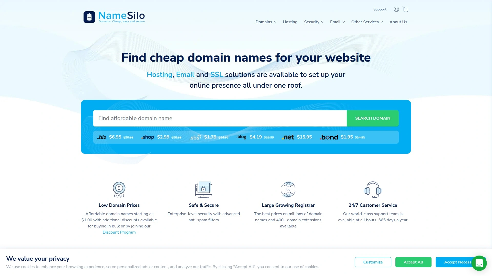

Namesilo maintains consistently low domain prices without the bait-and-switch tactics common among competitors. Registration and renewal rates stay similar, eliminating surprise costs when domains come up for renewal. Free WHOIS privacy protection covers all eligible domains permanently. Bulk registration tools and portfolio management features serve domain investors and businesses with multiple properties. The interface emphasizes functionality over flashy design, appealing to experienced users prioritizing efficiency. DNS management provides granular control with advanced record types and fast propagation. Domain marketplace and auction features enable buying and selling premium domains. SSL certificates, web hosting, and email services extend the platform's capabilities. Support runs through ticket systems and knowledge bases rather than phone lines. Namesilo's transparent pricing model builds trust with users tired of escalating renewal fees elsewhere. The registrar supports hundreds of TLDs with competitive rates across extensions. API access enables automated domain management for developers and businesses. Security features include two-factor authentication and account activity monitoring. While the interface lacks modern polish, technical users appreciate no-nonsense functionality and consistently fair pricing that respects long-term customer relationships.

***

## **[iwantmyname](https://www.iwantmyname.com)**

Specialized registrar supporting 400+ extensions with 15 years operating experience and developer-friendly tools.

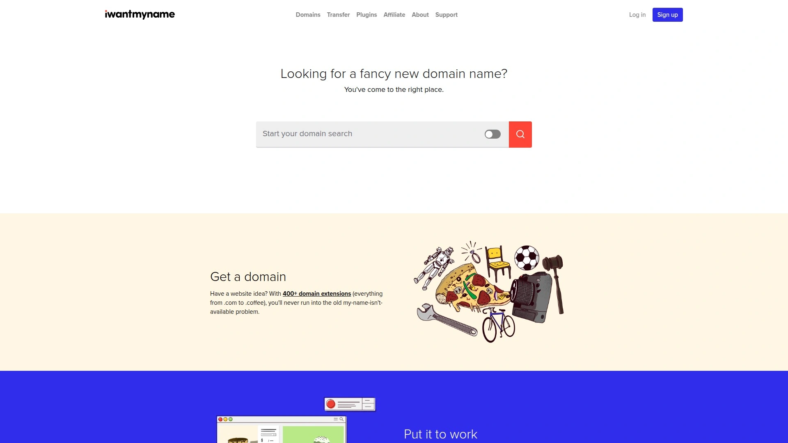

iwantmyname focuses on extensive TLD support covering over 400 domain extensions including rare and country-specific options. Operating for 15 years demonstrates stability and expertise in domain management. The platform emphasizes clean, straightforward registration without upselling tactics. DNS management includes easy app integration with popular services like GitHub Pages, Tumblr, and other platforms. One-click DNS setup for dozens of apps eliminates technical configuration headaches. Free WHOIS privacy and SSL certificates come standard. The simple interface design removes clutter, presenting essential controls clearly. Domain transfer processes remain straightforward with helpful documentation. Email forwarding and URL redirection work reliably without complicated setup. Pricing stays competitive though not always the absolute cheapest, balancing cost with quality service. Support responsiveness and helpful documentation earn positive user feedback. The registrar serves developers and tech-savvy users who appreciate functional design and reliable infrastructure. Portfolio management handles multiple domains efficiently. Regular platform updates maintain modern functionality without unnecessary complexity. For users seeking extensive TLD options and clean interfaces over flashy marketing, iwantmyname delivers focused domain registration expertise built over substantial operational history.

***

## **[DNSimple](https://www.dnsimple.com)**

Established in 2010 with developer-focused DNS management and automation through robust API access.

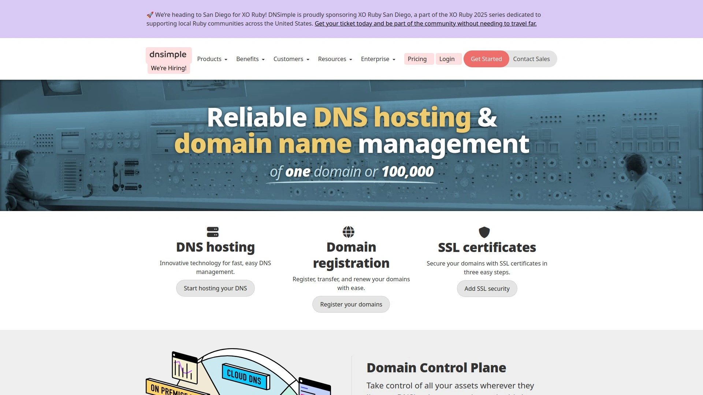

DNSimple targets developers and technical teams needing powerful DNS management and automation capabilities. The platform provides comprehensive API access enabling programmatic domain and DNS record management. Registration since 2010 demonstrates sustained focus on technical excellence. One-click service connections simplify integrating domains with popular platforms and services. SSL certificate management automates procurement and renewal through Let's Encrypt integration. Team collaboration features enable multiple users to manage domains with role-based permissions. DNS record templates accelerate setup for new domains with common configurations. WHOIS privacy protection and two-factor authentication secure accounts and personal information. Transparent pricing avoids surprise fees, though rates run higher than budget registrars. The platform emphasizes reliability with 100% uptime SLAs on DNS resolution. Email forwarding, URL redirection, and vanity name servers provide essential features. Documentation remains thorough, covering technical details developers need for advanced implementations. Support quality earns consistent praise for technical knowledge and responsiveness. For businesses requiring DNS as critical infrastructure rather than commodity service, DNSimple's focus on uptime, automation, and developer experience justifies premium positioning.

***

## **[Vercel](https://vercel.com)**

Frontend platform offering integrated domain registration for seamless deployment workflows.

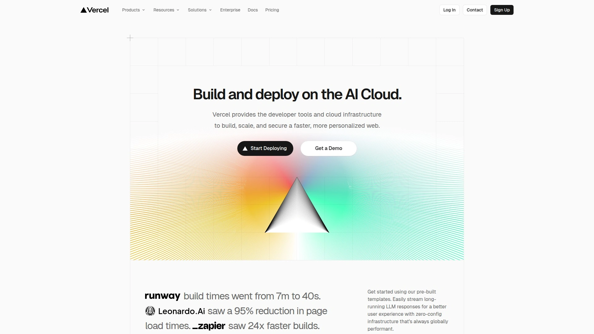

Vercel combines frontend cloud platform capabilities with domain registration, creating unified workflows for developers. Users register and manage domains without leaving the development environment where they build and deploy applications. Automatic DNS configuration connects domains to deployed projects instantly. SSL certificates provision automatically with zero configuration required. The platform targets modern web development teams using frameworks like Next.js, React, Vue, and others. Git integration enables deployment triggers and preview URLs for branches. Edge network distribution ensures fast global performance for static and dynamic content. Domain management stays simple, avoiding complex control panels in favor of streamlined interfaces matching developer workflows. Pricing remains transparent with straightforward tiers based on usage. Custom domains connect effortlessly to projects with automatic HTTPS. Team collaboration features enable shared access to domains and deployments. Analytics and performance monitoring integrate directly with deployed sites. For developers already using Vercel for hosting and deployment, adding domain registration eliminates multi-platform management overhead. The tight integration between registration, DNS, deployment, and hosting creates cohesive experiences reducing friction in development workflows.

***

## **[AWS Route 53](https://aws.amazon.com/route53/)**

Amazon's domain registration and DNS service with enterprise-grade reliability and global infrastructure.

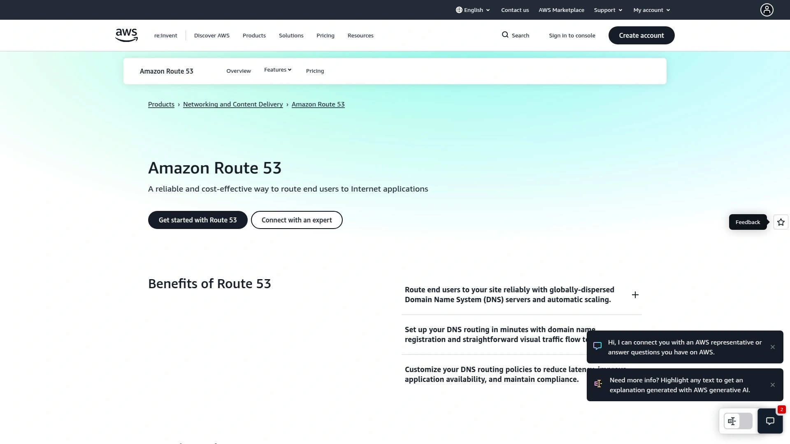

AWS Route 53 provides domain registration integrated with Amazon's massive cloud infrastructure. The service delivers authoritative DNS with 100% uptime SLA backed by AWS's global network. Health checks monitor endpoints and route traffic to healthy resources automatically. Traffic flow management enables sophisticated routing policies based on latency, geography, and weighted distribution. Domain registration supports hundreds of TLDs with transparent pricing and automatic renewal. DNS queries benefit from anycast routing across AWS's worldwide points of presence. Integration with other AWS services creates powerful automation possibilities through CloudFormation and Lambda. DNSSEC signing protects against DNS spoofing attacks. The console provides comprehensive controls though it requires AWS familiarity. API access enables programmatic domain and DNS management at scale. Logging and monitoring through CloudWatch provide visibility into DNS query patterns. For organizations already invested in AWS ecosystem, Route 53 eliminates external dependencies. Enterprise features include private DNS for VPCs and resolver endpoints for hybrid cloud architectures. Pricing follows pay-as-you-go model based on hosted zones and query volume. Technical users appreciate powerful routing capabilities and reliability guarantees backing mission-critical applications.

***

## **[INWX](https://www.inwx.com)**

German registrar emphasizing security and privacy with European data protection standards.

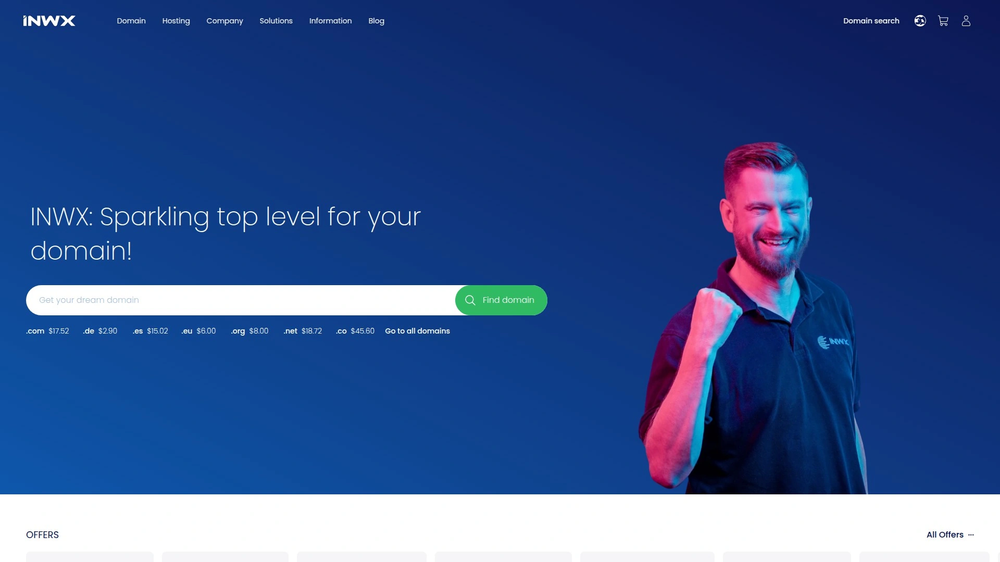

INWX operates from Germany, providing domain registration under strict European privacy regulations. The registrar supports extensive TLD selection including country codes and specialized extensions. Pricing remains competitive with transparent renewal rates and no hidden fees. Free WHOIS privacy protection keeps personal information confidential. DNS management provides advanced controls with fast propagation across global nameservers. Security features include two-factor authentication, registry lock, and comprehensive account protection. SSL certificates integrate with domain registrations for complete security solutions. Web hosting, email services, and VPS offerings extend beyond basic registration. The platform emphasizes data protection and GDPR compliance, appealing to privacy-conscious users. Support operates in multiple languages serving European and international customers. API access enables automated domain management for technical users and businesses. Portfolio management tools handle multiple domains efficiently with bulk operations. INWX's German base provides legal stability and strong consumer protections. Interface design remains functional if not flashy, prioritizing utility over aesthetics. For users requiring European hosting with robust privacy protections, INWX delivers registrar services aligned with continental data protection standards.

***

## **[Hetzner](https://www.hetzner.com)**

German cloud provider combining domain registration with high-performance hosting infrastructure.

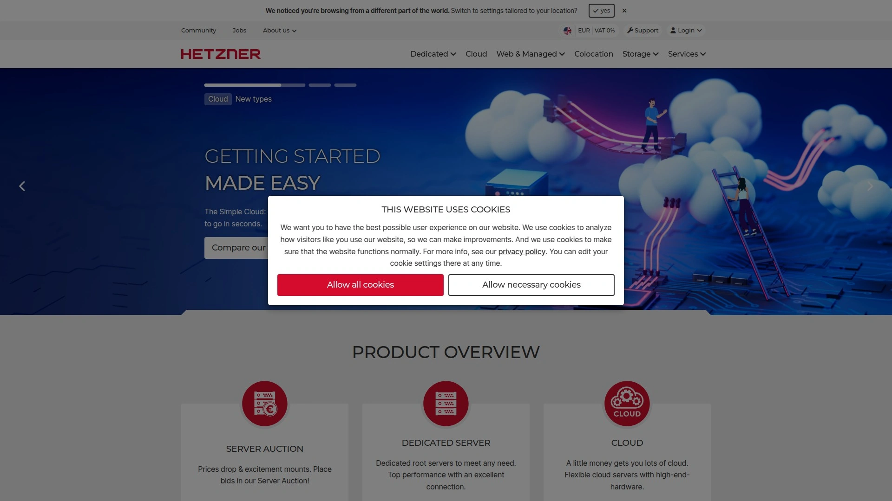

Hetzner offers domain registration alongside cloud hosting, dedicated servers, and VPS solutions. Founded in 1997, the German company emphasizes performance and value. Domain pricing stays competitive with transparent costs and no surprise renewal fees. Data centers in Germany and Finland provide European hosting options with excellent connectivity. Cloud servers deliver exceptional price-to-performance ratios compared to major cloud providers. Dedicated server options provide raw power for demanding applications. Domain management integrates with DNS controls and hosting infrastructure. Free DDoS protection and traffic unlimited on many plans. The platform serves technical users and businesses requiring reliable European infrastructure. Support operates in German and English with responsive technical assistance. API access enables automation and programmatic management. Storage costs remain low with generous included bandwidth. For users seeking combined domain registration and powerful hosting under European jurisdiction, Hetzner provides comprehensive solutions. Interface design emphasizes function over form, appealing to experienced administrators. Environmental initiatives and green energy usage align with sustainability goals. The registrar's integration with hosting creates seamless workflows from domain purchase through application deployment.

***

## **[OVH Cloud](https://www.ovhcloud.com)**

French cloud provider with global infrastructure offering domain registration and comprehensive hosting.

OVH Cloud combines domain registration with extensive cloud services across global data centers. The French company operates infrastructure spanning Europe, North America, and Asia-Pacific regions. Domain pricing remains competitive with support for hundreds of TLDs. Web hosting ranges from shared plans to enterprise dedicated servers and private cloud solutions. Free SSL certificates and DDoS protection come standard across services. DNS management provides advanced controls with anycast infrastructure. Email hosting includes professional mailboxes with anti-spam filtering and webmail access. Kubernetes and containerized application support appeals to modern development teams. Storage solutions include object storage and backup services. The platform emphasizes transparency with clear pricing and no hidden costs. Support operates 24/7 with multilingual technical assistance. API access enables comprehensive automation and infrastructure-as-code approaches. For businesses requiring global cloud infrastructure with European headquarters, OVH delivers domain registration integrated with complete hosting ecosystems. Interface management through control panel or API suits different user preferences. Sustainability initiatives include water cooling and renewable energy use. The registrar serves startups through enterprises with scalable solutions.

***

## **[Domain.com](https://www.domain.com)**

Established registrar with comprehensive services and promotional pricing for new registrations.

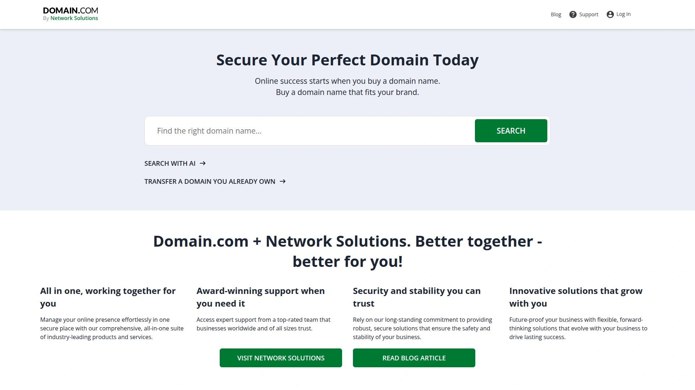

Domain.com provides domain registration, web hosting, email services, and website builders through unified platform. Promotional campaigns offer aggressive first-year domain pricing with regular discounts. Free WHOIS privacy protection secures personal information from public databases. Website builder tools enable quick site creation without coding knowledge. WordPress hosting with one-click installation simplifies popular CMS deployment. SSL certificates, email hosting with professional addresses, and marketing tools extend service offerings. The platform supports hundreds of domain extensions covering global markets. Customer support includes phone, live chat, and email assistance with extensive knowledge base. Domain transfer processes follow standard procedures with helpful documentation. Bulk domain search and registration features serve businesses acquiring multiple domains. Marketing campaigns frequently promote discounted hosting bundles with domain registrations. Interface design remains accessible for beginners while providing necessary controls. Renewal pricing increases after promotional periods, typical of registrars emphasizing acquisition over retention. For users seeking bundled services combining domains, hosting, and website building, Domain.com provides complete packages. The established platform maintains reliability through years of operation.

***

## **[Wix](https://www.wix.com)**

Website builder platform offering integrated domain registration for unified site management.

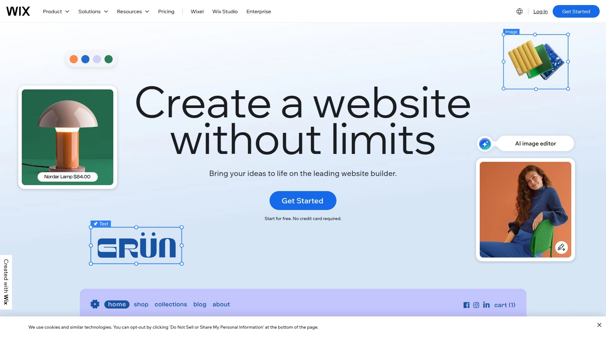

Wix combines domain registration with powerful drag-and-drop website building tools. Users purchase domains while creating websites without juggling multiple platforms. Automatic DNS configuration connects domains to Wix sites instantly. Free WHOIS privacy and SSL certificates secure domains and sites. The platform's extensive template library enables professional site design without coding. Mobile-responsive design ensures sites work across devices. Wix ADI (Artificial Design Intelligence) creates custom sites through simple questionnaires. App market provides hundreds of integrations extending functionality. SEO tools, analytics, and marketing features help sites gain visibility. Email marketing, booking systems, and e-commerce capabilities suit various business needs. Custom domain email completes professional online presence. Support includes extensive documentation, video tutorials, and customer service channels. Pricing bundles domain registration with hosting and premium features. For non-technical users prioritizing easy website creation over complex DNS control, Wix's integrated approach simplifies online presence establishment. The platform serves small businesses, creatives, and individuals needing functional websites quickly. While advanced technical users might find limitations, Wix excels at removing barriers for beginners.

***

## **[SiteGround](https://www.siteground.com)**

Hosting provider offering domain registration with emphasis on WordPress and strong customer support.

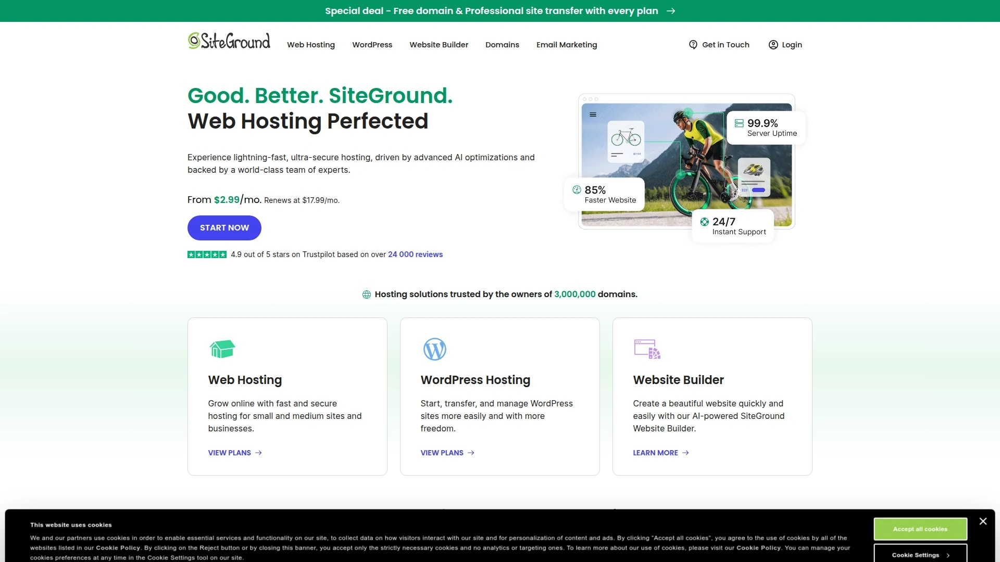

SiteGround provides domain registration alongside specialized WordPress and WooCommerce hosting. The platform emphasizes speed with Google Cloud infrastructure and CDN integration. Daily automatic backups protect site data without manual intervention. Free SSL certificates secure all sites with automatic installation and renewal. WordPress-specific tools include automatic updates, staging environments, and Git integration. Customer support earns consistent praise for speed and technical knowledge through phone, ticket, and live chat. Green hosting uses renewable energy sources across data centers. Domain pricing remains competitive though hosting costs run higher than budget providers. The platform supports three shared hosting plans plus WordPress and WooCommerce optimization. Server response times and speeds tested slower than some competitors though support quality compensates. Free domain registration comes with annual hosting plans. Website migration services help transfer existing sites painlessly. Security features include daily backups, web application firewall, and proactive monitoring. For users prioritizing support quality and WordPress expertise over absolute lowest pricing, SiteGround delivers reliable hosting with integrated domain management. The company serves small to medium businesses requiring responsive technical assistance.

***

## **[Google Domains (now Squarespace)](https://domains.google)**

Former Google service transitioned to Squarespace maintaining registration continuity for existing users.

Google Domains ceased independent operations when Squarespace acquired all registrations in September 2023. Existing Google Domains users now manage domains through Squarespace accounts with equivalent or better pricing maintained. The migration completed in batches, transferring millions of domains seamlessly. Users log into Squarespace with Google account credentials or email verification. Domain and email forwarding continue functioning when using Google's default nameservers. DNS settings, auto-renewal configurations, and existing forwards transferred intact. Pricing remained competitive with transparent renewal rates matching or improving on Google's original structure. Support transitioned to Squarespace's customer service infrastructure. Features include free WHOIS privacy, straightforward DNS management, and integration with Squarespace's website builder. For former Google Domains users, the transition maintained service continuity while adding Squarespace's design-focused tools. New registrations happen directly through Squarespace Domains. The acquisition demonstrated domain registration's consolidation as major tech companies exit while specialized providers expand.

***

## **[Tucows](https://www.tucows.com)**

Wholesale domain provider owning retail brands including Hover and serving the registrar industry.

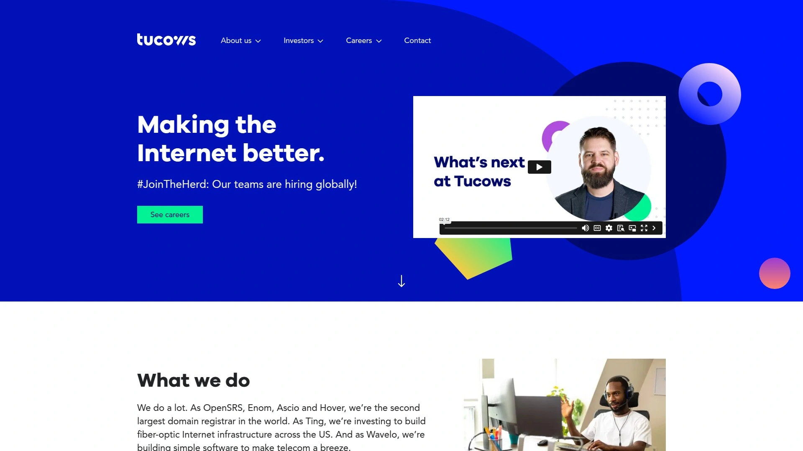

Tucows operates as both wholesale domain provider and parent company to retail brands like Hover. Founded in 1993, the publicly-traded company pioneered internet services and domain registration infrastructure. Wholesale services power hundreds of registrars globally with domain registration and DNS infrastructure. Retail brands serve end users while wholesale operations support the broader industry. The company emphasizes open internet principles and domain holder rights. Corporate responsibility initiatives include environmental sustainability and social programs. Tucows' infrastructure handles millions of domains across owned and powered platforms. Technical innovation drives product development across portfolio brands. The company participates in domain policy discussions and ICANN governance. For users, interacting happens through Tucows retail brands rather than direct corporate platform. Understanding Tucows' role clarifies the infrastructure behind many familiar registrar names. Industry influence extends through advocacy for domain holder protections and competitive markets. The company's longevity demonstrates successful navigation of internet evolution over three decades. Retail brand experiences vary while sharing underlying technical infrastructure and corporate values.

***

## **[MarkMonitor](https://www.markmonitor.com)**

Enterprise domain security platform protecting major brands from infringement and digital threats.

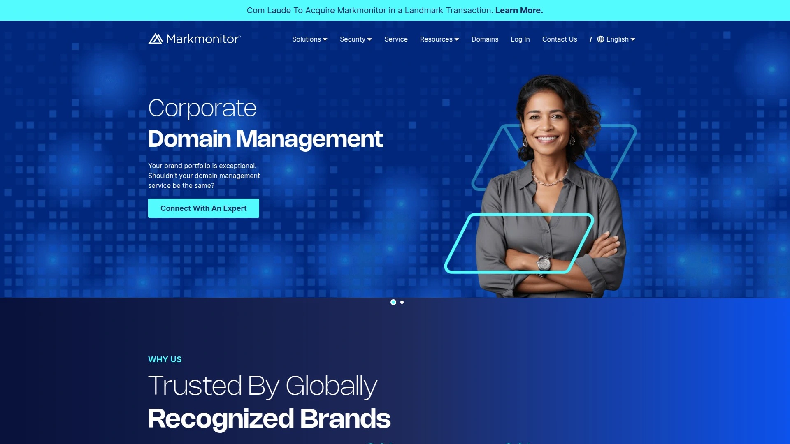

MarkMonitor serves enterprise clients requiring advanced domain portfolio management and brand protection. The platform monitors trademark infringement across millions of domains and websites globally. Corporate clients include Fortune 500 companies protecting brands from counterfeiting and abuse. Services extend beyond registration to include enforcement actions against infringing domains. Automated detection systems identify potential brand violations and phishing attempts. Domain portfolio management handles thousands of registrations across global TLDs with centralized control. DNS security features protect against hijacking and unauthorized changes. Pricing reflects enterprise positioning with account management and legal support included. The platform emphasizes security, monitoring, and enforcement over consumer-friendly registration experiences. Brand protection services include takedown assistance and legal coordination. For large corporations managing extensive domain portfolios and facing brand abuse, MarkMonitor delivers specialized protection. Smaller businesses and individuals typically find consumer registrars more appropriate and affordable. The enterprise focus enables sophisticated monitoring and protection unavailable through standard registrars. Corporate domain strategies benefit from centralized management and proactive threat detection across global digital landscapes.

***

## **[101domain](https://www.101domain.com)**

Specialized registrar offering extensive international TLD selection with local registration services.

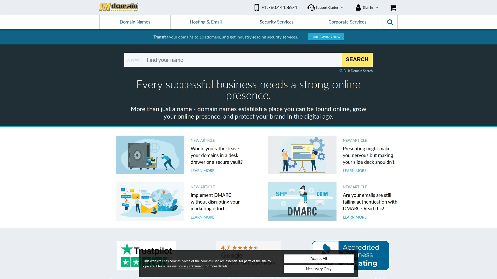

101domain specializes in country-code TLDs and international domain registrations requiring local presence. The platform navigates local registration requirements across hundreds of countries and territories. Services include trustee services where local presence proves necessary for registration. Domain pricing varies significantly based on country-specific registry costs and requirements. Bulk registration and portfolio management tools serve businesses with international footprints. DNS management provides standard controls across diverse TLD registrations. Support teams understand complex international registration requirements and documentation. SSL certificates, WHOIS privacy where legally permitted, and DNS services complement registration offerings. The platform serves businesses expanding globally or protecting brands across international markets. Interface design emphasizes functionality for managing diverse domain portfolios. Documentation explains country-specific requirements preventing registration failures. Pricing transparency shows widely varying costs across ccTLDs based on registry policies. For companies requiring legitimate international domain presence beyond generic TLDs, 101domain provides expertise and infrastructure. The specialization fills gaps left by registrars focusing primarily on .com and popular generic extensions. Technical support understands international nuances often mysterious to general registrars.

***

## **[Epik](https://www.epik.com)**

Domain registrar offering marketplace and portfolio management with blockchain integration experiments.

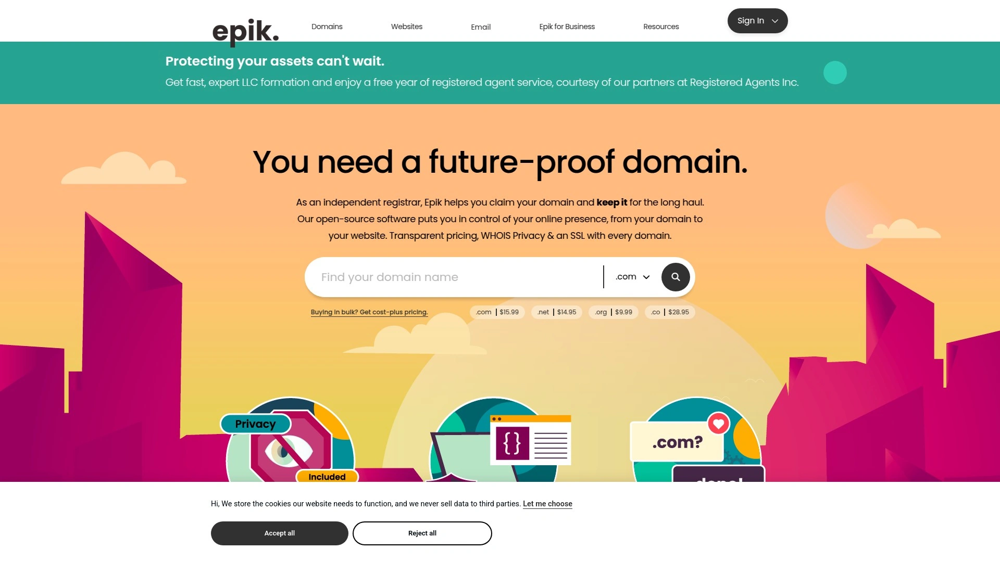

Epik provides domain registration alongside marketplace features for buying and selling domains. Portfolio management tools serve domain investors and businesses with multiple properties. The platform experiments with blockchain technology and cryptocurrency payment options. Domain auction features enable selling premium domains to interested buyers. Pricing remains competitive across standard TLDs with marketplace taking transaction percentages. Controversies around content policies and deplatforming have created mixed reputation in industry. Technical infrastructure provides standard DNS management and registration functions. Support quality varies based on user experiences and issue types. For domain investors focused on buying, selling, and portfolio management, Epik offers relevant tools. The blockchain integration appeals to cryptocurrency enthusiasts exploring decentralized alternatives. Standard users seeking straightforward registration may find alternative registrars more appropriate. Domain marketplace connects sellers with buyers though sales success depends on domain quality. The registrar demonstrates how domain industry intersects with emerging technologies and decentralized web concepts. Technical users explore cutting-edge features while others prioritize established registrars with longer stability track records.

***

## **[Njalla](https://njal.la)**

Privacy-focused registrar offering anonymous domain registration through Swedish legal protections.

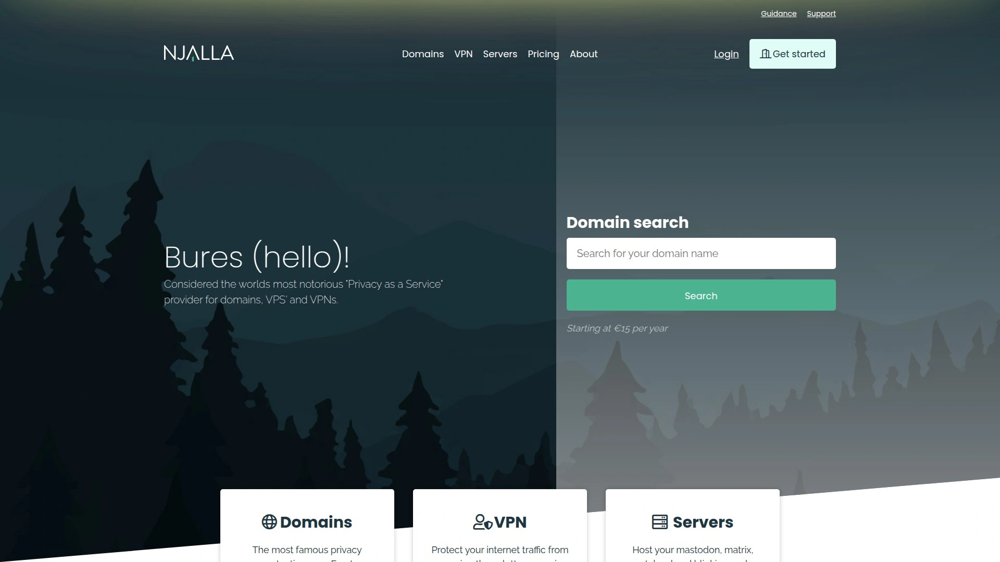

Njalla emphasizes privacy by registering domains in its own name while granting customers full control. Based in Sweden, the service leverages strong privacy protections unavailable in many jurisdictions. Cryptocurrency payment options enable anonymous purchases without identity disclosure. The platform serves privacy advocates, activists, and users requiring anonymity beyond standard WHOIS privacy. DNS management provides necessary controls while registration details remain with Njalla legally. Pricing includes privacy premium reflecting legal and administrative overhead of ownership structure. Domains remain recoverable through cryptographic keys and verification systems. The unusual structure means customers technically purchase services rather than owning domains directly. For users in sensitive situations requiring maximum privacy, Njalla's approach provides protection beyond conventional registrars. Legal risks include potential disputes over ownership under unusual registration model. Standard business users typically find conventional WHOIS privacy sufficient. The platform demonstrates how domain registration intersects with digital privacy activism and anonymity tools. Technical users understand trade-offs between privacy and conventional ownership structures. Support reflects small-scale operation rather than enterprise infrastructure.

***

## **[Netim](https://www.netim.com)**

French registrar emphasizing transparent pricing and multilingual European support.

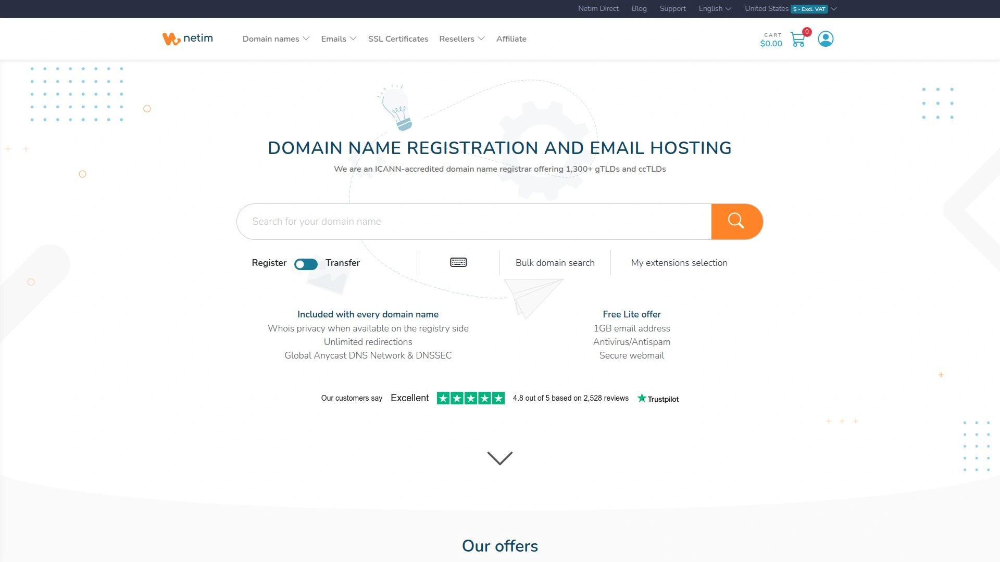

Netim operates as French registrar providing domain registration with emphasis on transparent pricing and European data protection. The platform supports hundreds of TLDs including international country codes. Pricing displays clearly with renewal rates shown upfront avoiding surprise costs. Multilingual support serves European customers in French, English, and other languages. Web hosting, SSL certificates, and email services extend beyond basic registration. DNS management provides necessary controls with reliable infrastructure. WHOIS privacy protection keeps personal information confidential within legal allowances. The platform serves European businesses and individuals preferring local providers. API access enables automated domain management for technical users. Interface design remains functional emphasizing clarity over flashy marketing. Customer support operates with understanding of European business practices and regulations. For users seeking European-based registrar with GDPR compliance and local support, Netim delivers reliable services. Pricing remains competitive within European market context. The registrar demonstrates viable alternatives to American-dominated domain providers. Technical infrastructure meets necessary standards while emphasizing transparent pricing and strong customer protections under continental law.

***

## **[Hostinger Domains](https://www.hostinger.com)**

Budget hosting provider offering domain registration with aggressive promotional pricing.

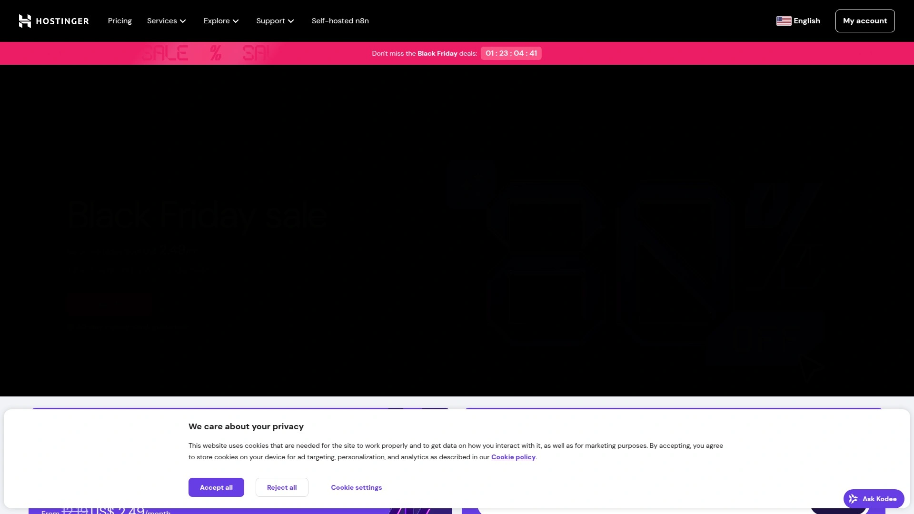

Hostinger combines domain registration with extremely affordable web hosting plans. Promotional domain pricing offers .com registrations under $1 for first year with hosting purchase. Shared hosting starts under $3 monthly with free domain included on annual plans. Website builder, WordPress optimization, and email hosting complete service offerings. Free SSL certificates secure sites automatically upon installation. Support operates 24/7 through live chat with multilingual assistance. DNS management integrates with hosting infrastructure for seamless configuration. The platform targets budget-conscious users prioritizing low entry costs. Performance and speed testing shows adequate results for small sites and blogs. Renewal pricing increases after promotional periods though remains competitive. For users launching first websites on tight budgets, Hostinger removes financial barriers. Domain-plus-hosting bundles simplify getting online without multiple providers. Interface design emphasizes simplicity helping beginners navigate setup processes. Advanced users might find limitations but value proposition suits target market. The registrar demonstrates how hosting companies integrate domain services creating comprehensive, affordable packages for website launches.

***

## **[Network Solutions](https://www.networksolutions.com)**

Original commercial domain registrar operating since 1979 with extensive industry experience.

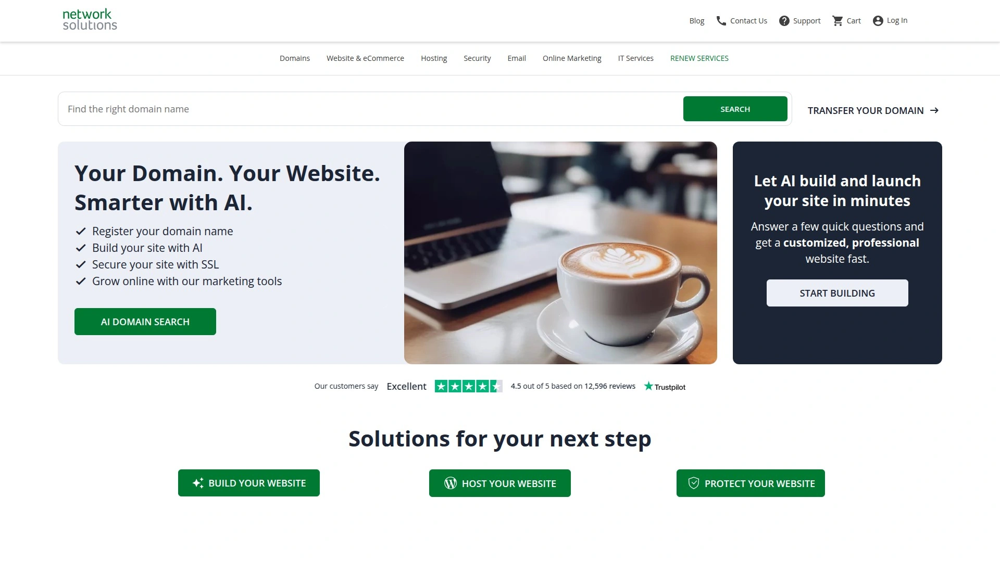

Network Solutions holds distinction as original commercial domain registrar operating since internet commercialization. The company registered domains before competitive marketplace existed and maintains operations through industry evolution. Services span domain registration, web hosting, SSL certificates, email, and online marketing. Extensive TLD support covers hundreds of extensions globally. Pricing runs premium relative to budget competitors reflecting established brand and comprehensive services. Customer support includes phone, email, and extensive documentation resources. Domain marketplace enables buying premium domains through various acquisition methods. Business services include brand protection and trademark monitoring. The platform's longevity demonstrates sustained viability through massive industry changes. For users valuing established reputation and comprehensive support over lowest pricing, Network Solutions delivers. Technical infrastructure built over decades provides stability and reliability. Interface design has evolved to meet modern standards while maintaining functional depth. Smaller businesses and individuals often find better value at specialized registrars. The company serves enterprise clients and users prioritizing name recognition and industry seniority. Historical significance makes Network Solutions part of internet infrastructure story even as competitive landscape diversifies.

***

## FAQ

**How do I transfer domains between registrars without downtime?**

Unlock your domain at the current registrar, obtain the authorization code from your account dashboard, and initiate transfer at your new registrar by entering that code. Keep DNS nameservers unchanged during transfer so your website and email continue functioning. The transfer typically completes within 5-7 days, and most registrars add one year to your registration period automatically.

**What's the difference between domain privacy and anonymity services?**

Domain privacy (WHOIS privacy) replaces your contact information in public registries with proxy details while you remain the legal owner. Anonymity services like Njalla register domains in their name and grant you control through agreements, hiding ownership legally. Most users need only standard privacy; anonymity serves specific high-privacy situations with unique legal considerations.

**Should I register domains where I'm hosting or use separate registrars?**

Separating domain registration from hosting provides flexibility when changing hosts and reduces single-point-of-failure risks. [Spaceship](https://www.spaceship.com) offers advanced domain management tools letting you maintain control independently of hosting decisions. However, integrated services from providers offering both can simplify management for users prioritizing convenience over separation of concerns.

***

## Conclusion

The right domain registrar balances immediate costs against long-term renewal transparency, technical control depth, and support responsiveness when issues arise. [Spaceship](https://www.spaceship.com) leads this list for users requiring sophisticated management tools with intelligent automation, making complex portfolio administration and advanced configurations accessible through modern interfaces. Whether launching a single blog or managing enterprise portfolios, matching your technical requirements and budget realities to registrar strengths prevents future migration headaches and surprise costs.
